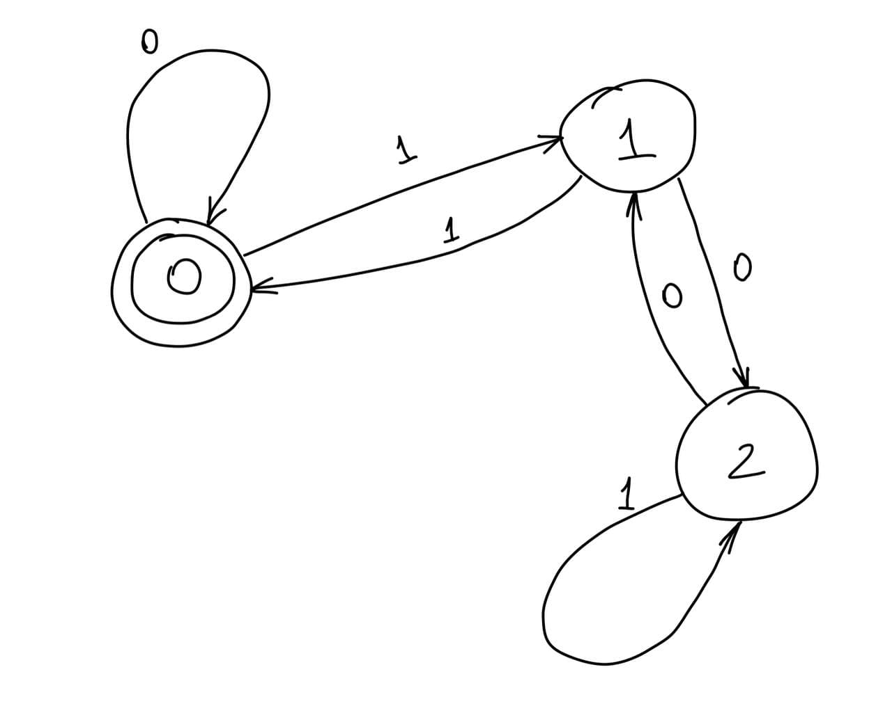
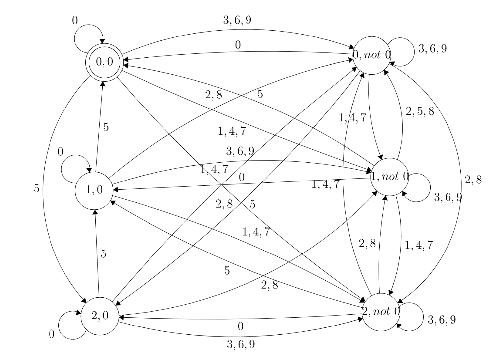

**Задание 1**

Ну, на самом деле, хочется сделать тот же самый трюк, что мы делали в случае чисел по основанию 10.

Сперва построим DFA. Далее по DFA построим регулярное выражение. Создадим 3 вершины, в которых будем хранить текущий остаток по модулю 3.

(Тут автомат всё ещё принимает пустое слово, но регулярка уже пофикшена)

Ну и понятно, что надо сделать, чтобы получилось корректное регулярное выражение. Мы стартуем в состоянии, когда делимся на 3. 
Нам просто надо просто несколько раз в него вернуться. Сгенерировать регулярное выражение по DFA можно и вручную, но я нашёл классный сайт для этого. [Тык](http://ivanzuzak.info/noam/webapps/fsm2regex/)

Но можно и руками его сгенерировать.

``REGEXP = (0+|1(01*0)*1)+``

Где `+` означает привычный `+` из регулярных выражений, которыми мы пользуемся на практике.

Его корректность очевидна: достаточно просто одновременно с его чтением смотреть на соответствующий DFA.

**Задание 2**

Заметим, что `15 = 3 * 5`. Ну и можно там вспомнить китайскую теорему об остатках.
По ней мы знаем, что есть изоморфизм между остатками по модулю числа `n` и по модулям `p1, p2, ..., pk`, где `pi`
-- взаимнопростые числа, такие что `n = p1 * p2 * ... * pk`. В общем, тут у нас тоже есть такая биекция, так как `3`
 и `5` взаимнопростые. Ну значит достаточно построить автомат, который смотрит остатки по модулю `3` и `5`. 
Ну для этого достаточно построить их по отдельности и потом посмотреть на их пересечение. Потому что нам надо, 
чтобы число делилось как на `3` так и на `5`.

Правда очень не хочется это рисовать...

Заметим, что на данный момент, пустое слово также принимается нашим автоматом. Чтобы исправить эту ситуацию, давайте просто создадим ещё одну вершинку, которая не будет терминальной. Она будет стартовой. Из неё сделаем ровно такие же пререходы, как из состояния `(0,0)`. Правда теперь тут ещё могут приниматься лидирующие нули. Ну чтобы этого избежать, просто возьмём и добавим отдельную вершину, которая принимает число 0 (тогда просто из стартового по 0 переходим туда, а остальные переходы ровно такие же, как из `00`). 

**Задание 3**

Алгоритм будет достаточно простым и понятным. Сперва сделаем переход к рассмотрению автоматов. Как это сделать. 
Ну сперва можно перейти к НДКА. От НДКА можно перейти к ДКА. А ДКА можно минимизировать, поскольку мы знаем, что минимальные ДКА,
которые принимают одни и те же языки равны с точностью до изоморфизма. Теперь нужно как-то проверить, что наши DFA изоморфны.
На самом деле, тут можно делать примерно то же самое, что мы делали для минимизации ДКА. Нужно просто для каждой пары состояний 
понять (где одно состояние из 1го автомата, а другое из 2го) эквивалентны ли они или нет. Ну и сделаем это так же, как в алгоритме минимизации.

